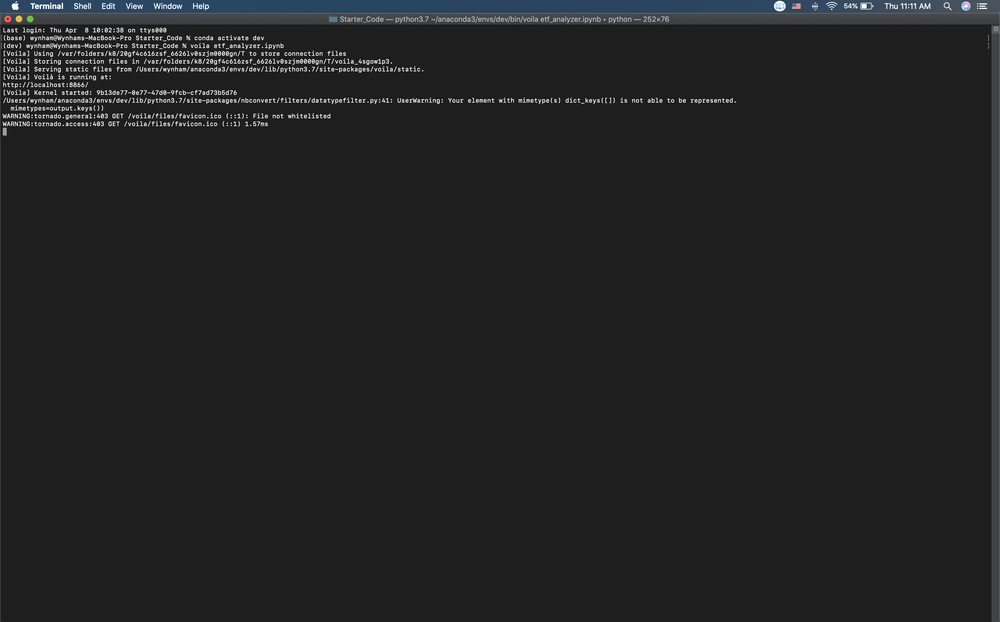
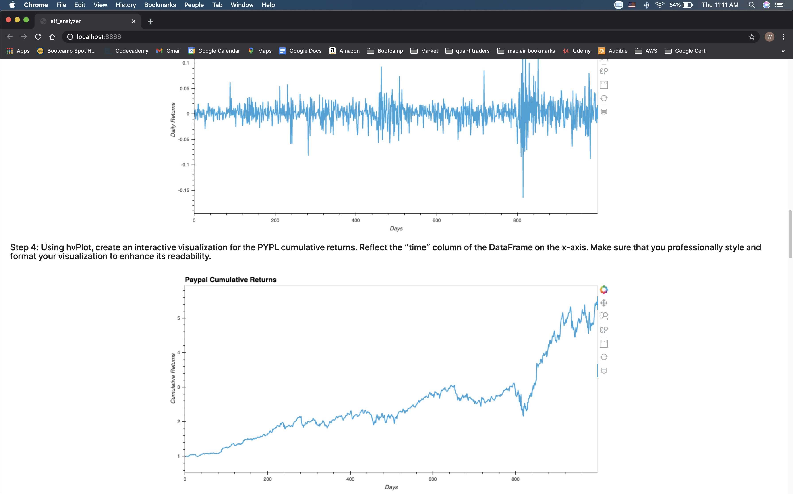
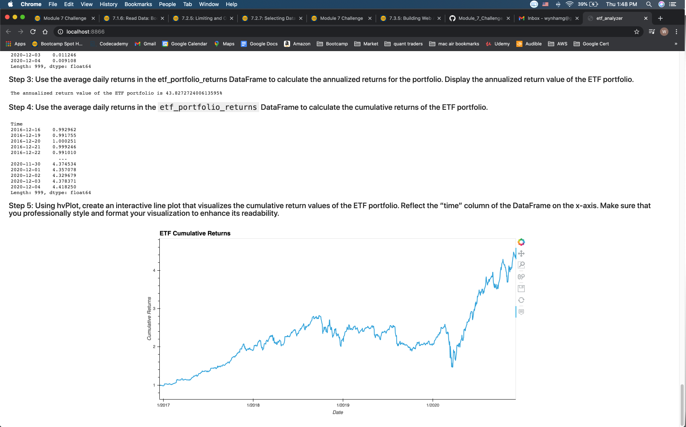

# Module 7 Challenge

This is the repository for my module 7 challenge. In this module challenge, we built a financial database and web application by using SQL, Python, and the Voilà library to analyze the performance of a hypothetical fintech ETF.

Our first step in this challenge was to analyze Paypal, one of the stocks in the ETF. Next we used advanced SQL queries to optimize data access and further analyze Paypal's stock. The next step was to analyze the performance of the entire ETF. Lastly, we used the Voila library to display or notebook in a web app. 

---

## Technologies

Import the following at the beginning of your jupyter notebook:

```python
import numpy as np
import pandas as pd
import hvplot.pandas
import sqlalchemy
```

---

## Example

This image shows how we launch the Voila web app from the terminal. Notice how we type in "Voila etf_analyzer.ipynb" into the terminal. The web app then launches.



The following image shows what the Voila web app looks like. In this part we see a graph of the Paypal stock cummulative returns.



This final image also shows what the Voila web app looks like. In this part we see a graph of the entire ETF cummulative returns.



---

## Contributors

UCB Fintech Bootcamp, Wynham Guillemot 

---

## License

MIT License

Copyright (c) [2021] [UCB Fintech Bootcamp, Wyham Guillemot]

Permission is hereby granted, free of charge, to any person obtaining a copy
of this software and associated documentation files (the "Software"), to deal
in the Software without restriction, including without limitation the rights
to use, copy, modify, merge, publish, distribute, sublicense, and/or sell
copies of the Software, and to permit persons to whom the Software is
furnished to do so, subject to the following conditions:

The above copyright notice and this permission notice shall be included in all
copies or substantial portions of the Software.

THE SOFTWARE IS PROVIDED "AS IS", WITHOUT WARRANTY OF ANY KIND, EXPRESS OR
IMPLIED, INCLUDING BUT NOT LIMITED TO THE WARRANTIES OF MERCHANTABILITY,
FITNESS FOR A PARTICULAR PURPOSE AND NONINFRINGEMENT. IN NO EVENT SHALL THE
AUTHORS OR COPYRIGHT HOLDERS BE LIABLE FOR ANY CLAIM, DAMAGES OR OTHER
LIABILITY, WHETHER IN AN ACTION OF CONTRACT, TORT OR OTHERWISE, ARISING FROM,
OUT OF OR IN CONNECTION WITH THE SOFTWARE OR THE USE OR OTHER DEALINGS IN THE
SOFTWARE.
